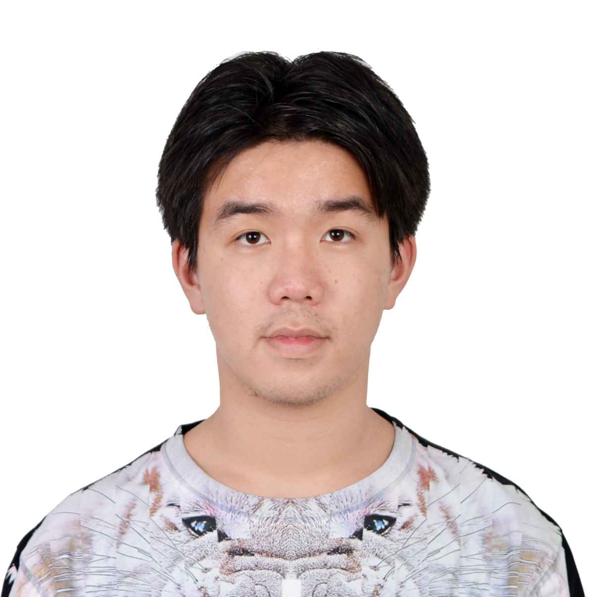

## About Me

Hi! I am a Senior year student Major in Applied Math and Computer Science in Rensselaer Polytechnic Institute, Co-advised by *Prof*. Jeffery Banks and *Prof*. Heng Ji.

## Research Interest

Statistical machine learning, Theoretical Machine Learning, Convex/Non-convex Optimization, Computational photography, Computer Vision.

## Graduate Course 

+ **Computational Linear Algebra** by *Prof*. William. D. Henshaw
+ **Machine Learning from Data** by *Prof*. Malik Magdon-Ismail

## Research Experience

+ **First-order methods for constrained convex programs**, Applied Math Department, RPI
  - As *Undergraduate Research Assistant*, supervised by *Prof*. Yangyang Xu
  - Report of the project is attatched __[here](https://drive.google.com/open?id=1JoE_FVOFfQKdZwJAPUM9hSiZ4FgssIcg)__

+ **A Systematic Way of Collecting and Fusing Multi-Modal Data for Cognitive Analysis Tasks**, Cognitive and Immersive Systems Lab, RPI
  - As *Undergraduate Research Developer*, co-worked with *PhD. Candidate* Xiangyang Mou, supervised by *Director* Hui Su
  - Project Poster on IBM 2018 Colloquium is __[here](https://docs.google.com/presentation/d/19T-0kqHzgbdRfMDD8YhkTc_pis4pd3PNcBSTdNUlFi8/edit?ts=5bb40940#slide=id.p1)__
  - Interview of the project could be found __[here](https://www.youtube.com/watch?v=0w6R_nDaHdI)__
  
## Industrial Experience

+ **The9 Limited**, Product Development Department, Shanghai, China, Summer 2017
  - As *Software Developer*, supervised by *Director* Haibo Xu

---

> The more I learn, the more I realize how much I don't know. ------Albert Einstein
